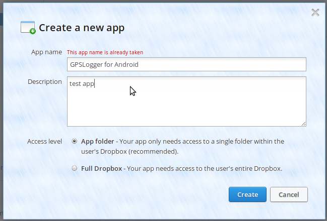
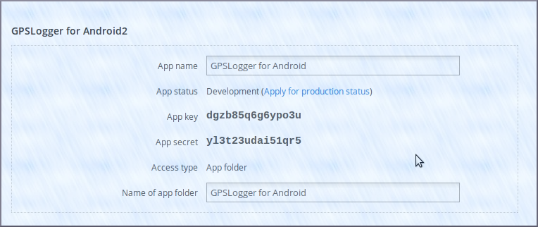
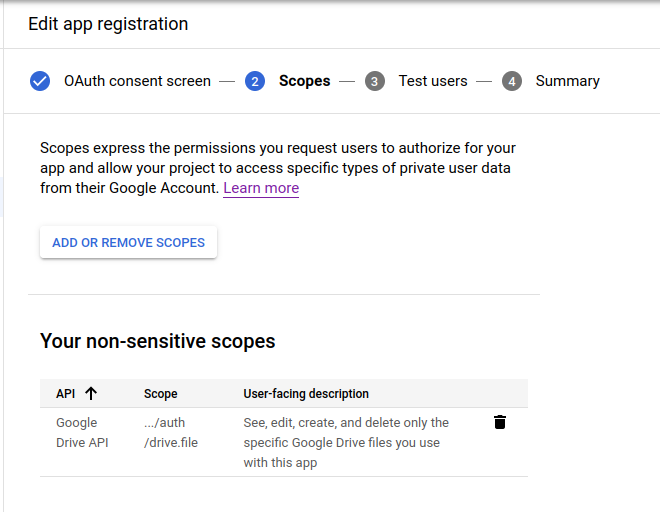
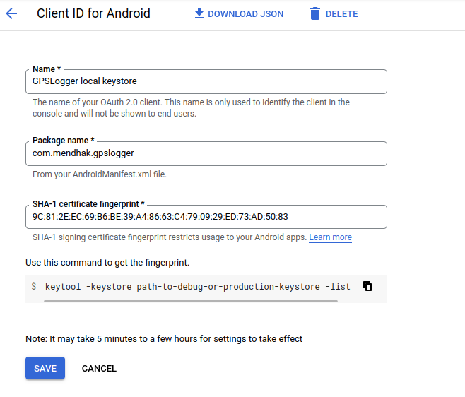

GPSLogger  [](https://github.com/mendhak/gpslogger/actions) [](https://keyserver.ubuntu.com/pks/lookup?op=get&search=0x95e7d75c76cbe9a9) [](https://hosted.weblate.org/engage/gpslogger/)
=========

GPSLogger is an Android app that logs GPS information to various formats (GPX, KML, CSV, NMEA, Custom URL) and has options for uploading (SFTP, OpenStreetMap, Google Drive, Dropbox, Email). This app aims to be as battery efficient as possible.

[Read about GPSLogger's features here](https://gpslogger.app/)

## Download

You can find it on [F-Droid](https://f-droid.org/en/packages/com.mendhak.gpslogger/) 

You can download directly [from the releases](https://github.com/mendhak/gpslogger/releases).


## Contribute

You can help with [translations](https://hosted.weblate.org/engage/gpslogger/) on Weblate.    

You can also submit [pull requests](https://help.github.com/articles/using-pull-requests) for bug fixes and new features.

I'm not very good at UIs, so any work with the layouts would be appreciated!  


## License and policy

[Licensed under GPL v2](LICENSE.md) | [Third party licenses](assets/text/opensource.md) | [Privacy policy](assets/text/privacypolicy.md)


## Verifying

It's good practice to verify downloads.  In recent releases, a PGP signature and an SHA256 checksum will accompany each `.apk`.

Import PGP Public Key from [the Ubuntu Keyserver](https://keyserver.ubuntu.com/pks/lookup?op=get&search=0x95e7d75c76cbe9a9) or just `gpg --recv-key 6989CF77490369CFFDCBCD8995E7D75C76CBE9A9`

To verify the integrity and signature:

    $ gpg --verify ~/Downloads/gpslogger-71.apk.asc
    
To verify checksum:    
    
    $ sha256sum -c ~/Downloads/gpslogger-71.apk.SHA256


Setting up the code
=========


The project is based on the [Android build system](http://tools.android.com/tech-docs/new-build-system/user-guide) plugin for Gradle.
These instructions are for Ubuntu Linux with Android Studio, but for other OSes, it should be roughly similar. 

### Set up your Android Development Environment

Follow the instructions on the [Android Developer Website](http://developer.android.com/sdk/installing/index.html) to set up your computer for development.

Download and install [Android Studio](https://developer.android.com/studio/install#linux) (there's also a [snap](https://snapcraft.io/android-studio))


### Clone the GPSLogger repository

    git clone git://github.com/mendhak/gpslogger.git

### Get the Android SDK extra repositories

This project uses certain Android libraries, you can install them using Google's poorly implemented [`sdkmanager`](https://developer.android.com/studio/command-line/sdkmanager.html):

      echo y | $HOME/android-sdk/tools/bin/sdkmanager 'tools'
      echo y | $HOME/android-sdk/tools/bin/sdkmanager 'platform-tools'
      echo y | $HOME/android-sdk/tools/bin/sdkmanager 'build-tools;26.0.2'
      echo y | $HOME/android-sdk/tools/bin/sdkmanager 'platforms;android-27'
      echo y | $HOME/android-sdk/tools/bin/sdkmanager 'platforms;android-25'
      echo y | $HOME/android-sdk/tools/bin/sdkmanager 'extras;google;m2repository'
      echo y | $HOME/android-sdk/tools/bin/sdkmanager 'extras;android;m2repository'
      echo y | $HOME/android-sdk/tools/bin/sdkmanager 'extras;google;google_play_services'


### Create local.properties

Create a file called `local.properties`, pointing at your Android SDK directory.

    cd gpslogger
    echo "sdk.dir=/home/mendhak/Programs/Android" > local.properties

### Import the project

Open up Android Studio and choose to import a project.  Select the topmost `build.gradle` file under GPSLogger.

If you get an Import dialog, choose to *Import project from external model*


On the next screen, choose the defaults and proceed (default gradle wrapper)


Give it a minute and Android Studio will configure the projects and download the various libraries.

### OpenStreetMap Setup (Optional)

Sign up for an account with [OpenStreetMap](https://openstreetmap.org) and log in.

Click on 'My Settings', then 'OAuth2 Applications'

Click on 'Register your application'

Fill in the form with these details. Remember to uncheck the 'Confidential Application' checkbox, since this is a mobile app. 


After registering the application, you will receive a Client ID.   
Place the Client ID in [OpenStreetMapManager#getOpenStreetMapClientID\(\)](gpslogger/src/main/java/com/mendhak/gpslogger/senders/osm/OpenStreetMapManager.java).   
If you used your own custom scheme, replace the value in [AndroidManifest.xml](gpslogger/src/main/AndroidManifest.xml) and [OpenStreetMapManager#getOpenStreetMapRedirect\(\)](gpslogger/src/main/java/com/mendhak/gpslogger/senders/osm/OpenStreetMapManager.java) 


### Dropbox Setup (Optional)

Sign up for an account with Dropbox.com

Go to the [Dropbox Developers page](https://www.dropbox.com/developers/apps) and click on 'Create an App'

Use these settings, but choose a unique name



After creating the app, you will receive an app key and secret (the ones in the screenshot are fake)



Place the keys in your `~/.gradle/gradle.properties` like this:


    GPSLOGGER_DROPBOX_APPKEY=abcdefgh
    GPSLOGGER_DROPBOX_APPSECRET=1234123456


Replace the Dropbox app key to your AndroidManifest.xml file

    <!-- Change this to be db- followed by your app key -->
    <data android:scheme="db-12341234"/>

### Google Drive Setup (optional)

Sign up to [Google Cloud Platform](https://console.cloud.google.com/).  Create a new project. 

Under APIs and Services, [enable the Google Drive API](https://console.cloud.google.com/apis/library/drive.googleapis.com).  
Next, go to the [Oauth Consent Screen](https://console.cloud.google.com/apis/credentials/consent), going through the steps until you reach scopes. 
Add the `https://www.googleapis.com/auth/drive.file` scope.  



[Create some OAuth credentials](https://console.cloud.google.com/apis/credentials), of type Android.  
Under package name, use `com.mendhak.gpslogger`. For the SHA-1 Certificate fingerprint, get it using the `keytool -keystore ~/.android/debug.keystore -list -v` command.




Overview
======

GPSLogger is composed of a few main components;


### Event Bus

The Event Bus is where all the cross communication happens.  Various components raise their events on the Event Bus,
and other parts of the application listen for those events.  The most important one is when a location is obtained,
 it is placed on the event bus and consumed by many fragments.

### GPS Logging Service

GPSLoggingService is where all the work happens.  This service talks to the location providers (network and satellite).
It sets up timers and alarms for the next GPS point to be requested.  It passes location info to the various loggers
so that they can write files.  It also invokes the auto-uploaders so that they may send their files to DropBox, OSM, etc.

It also passes information to the Event Bus.

### GPS Main Activity

This is the main visible form in the app.   It consists of several 'fragments' - the simple view, detailed view and big view.

It takes care of the main screen, the menus and toolbars.

The fragments listen to the Event Bus for location changes and display it in their own way.

### Session and AppSettings

Floating about are two other objects.  `Session` contains various pieces of information related to the current GPSLogger run,
such as current file name, the last known location, satellite count, and any other information which isn't static but is
needed for the current run of GPSLogger.

`AppSettings` is a representation of the user's preferences.

These objects are visible throughout the application and can be accessed directly by any class, service, activity or fragment.


## Assembling the APK for Github release

The 'assemble' Gradle task will build, and it also looks for a GPG key to sign the APK with. It needs some setup first:

Create `~/.gradle/gradle.properties` which contains the release store and its key details, as well as the GPG key details

```
RELEASE_STORE_FILE=/path/to/the.keystore
RELEASE_STORE_PASSWORD=xxxxxxxxxxxxxxxxxx
RELEASE_KEY_ALIAS=gpsloggerkey
RELEASE_KEY_PASSWORD=xxxxxxxxxxxxxxxxxx
signing.gnupg.keyName=xxxxxxxxxxxxxxxxxx
signing.gnupg.passphrase=xxxxxxxxxxxxxxxxxx
```

Ensure that gpg2 is installed

```bash
sudo apt install gnupg2
```

And ensure that the above gnupg.keyname is in the gpg keystore, have a look using `gpg2 --list-secret-keys`

Once these pieces are in place, the 'assemble' task should build the APK, sign it, and create a checksum too.    
If it doesn't appear in the gpslogger folder, run 'copyFinalAPK' so that it copies the APK, ASC and SHA256 files to the gpslogger folder.  
Finally upload to Github Releases.  

## F-Droid release

F-Droid watches the Github repository for tags, and will build those tags, and sign it using its own key. So, there isn't too much to do. 

Ensure that [gpslogger/build.gradle](gpslogger/build.gradle#L47-L48) `versionCode` and `versionName` contains the latest version number to be released. 

Finally tag the commit, 

```bash
git tag -s v128
```

## Working notes for F-Droid

Use the fdroidserver docker image.  Clone the fdroid metadata repo and make changes to the com.mendhak.gpslogger.yml file. 

    git clone https://gitlab.com/fdroid/fdroiddata.git
    cd fdroiddata

    # https://f-droid.org/en/docs/Submitting_to_F-Droid_Quick_Start_Guide/
    # initialize the metadata repo
    docker run --rm -v /home/mendhak/Android/Sdk:/opt/android-sdk -v $(pwd):/repo -e ANDROID_HOME:/opt/android-sdk registry.gitlab.com/fdroid/docker-executable-fdroidserver:master init -v
    
    # lint your metadata yml
    docker run --rm -v /home/mendhak/Android/Sdk:/opt/android-sdk -v $(pwd):/repo -e ANDROID_HOME:/opt/android-sdk registry.gitlab.com/fdroid/docker-executable-fdroidserver:master lint com.mendhak.gpslogger -v
    docker run --rm -v /home/mendhak/Android/Sdk:/opt/android-sdk -v $(pwd):/repo -e ANDROID_HOME:/opt/android-sdk registry.gitlab.com/fdroid/docker-executable-fdroidserver:master readmeta
    
    # see if the latest tag will get picked up. 
    docker run --rm -v /home/mendhak/Android/Sdk:/opt/android-sdk -v $(pwd):/repo -e ANDROID_HOME:/opt/android-sdk registry.gitlab.com/fdroid/docker-executable-fdroidserver:master checkupdates --auto com.mendhak.gpslogger
    docker run --rm -v /home/mendhak/Android/Sdk:/opt/android-sdk -v $(pwd):/repo -e ANDROID_HOME:/opt/android-sdk registry.gitlab.com/fdroid/docker-executable-fdroidserver:master rewritemeta com.mendhak.gpslogger

    # build
    docker run --rm -v /home/mendhak/Android/Sdk:/opt/android-sdk -v $(pwd):/repo -e ANDROID_HOME:/opt/android-sdk registry.gitlab.com/fdroid/docker-executable-fdroidserver:master build -v -l com.mendhak.gpslogger
    
    
